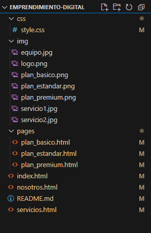
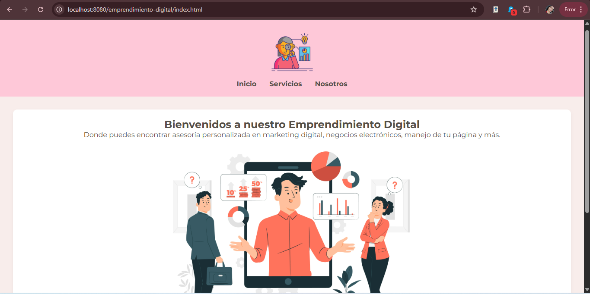

# Emprendimiento Digital

## Descripción 📄

Este proyecto corresponde a un taller práctico de HTML y CSS, donde se construye un sitio web básico con estilos visuales aplicados mediante hojas de estilo en cascada. El sitio incluye una página principal, una sección de servicios con diferentes planes, una página "Sobre nosotros" y páginas de detalles para cada plan de servicio. Se busca una presentación clara y adaptable a distintos dispositivos.

## Estructura de carpetas y archivos 📂



README.md


## Características implementadas ✨



- Página principal informativa.
- Sección de servicios con planes detallados.
- Página "Sobre nosotros".
- Diseño estilado con CSS.
- Diseño adaptable (responsivo).
- Botones con efectos interactivos.

## Instrucciones para clonar y visualizar el proyecto 💻

## Clonar el repositorio 💻

Para obtener una copia local del proyecto, puedes clonar el repositorio utilizando Git:

```bash
git clone git@github.com:karen-codes/emprendimiento-digital.git

Navega a la carpeta del proyecto clonado (opcional): Una vez que la clonación se complete, puedes entrar a la carpeta del proyecto con:

cd emprendimiento-digital

## Construido con 🛠️

- [Visual Studio Code](https://code.visualstudio.com/) – Editor de código
- [Git](https://git-scm.com/) – Control de versiones

## Autor ✒️

- Karen Cabascango ⌨️ Con ❤️ ([GitHub](https://github.com/karen-codes))